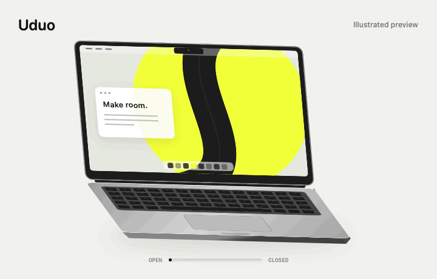
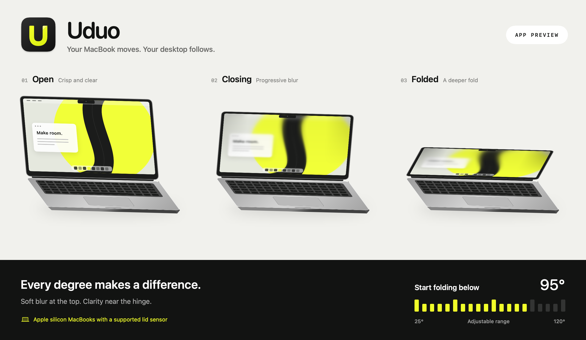

# Uduo

**Your MacBook moves. Your desktop follows.**

A small macOS app that turns opening and closing your screen into a live desktop effect.

[Download for Mac](https://github.com/Youdao-vibecoding/Uduo/releases/latest) · [简体中文](README.zh-CN.md) · [Build from source](BUILD.md)

Free and open source · macOS 14+ · Compatible Apple silicon MacBooks

See the three fold states

Interface preview. The desktop shown is an illustration, not a screen recording.

Lower the lid and your desktop folds, softens, and darkens toward the edges. Lift it and the motion reverses. Uduo follows the lid in both directions, including when you pause halfway and start moving again.

## Make it move your way

- **Keep the fold when you pause.** Leave the effect in place until you lift the screen, or choose to let the desktop sharpen when movement stops.
- **Set the starting angle.** Click or drag the 25–120° ruler. Changes save immediately; you can also use your screen's current angle.
- **Try it without moving your Mac.** Play the interactive preview once, then return to live readings. The preview uses an illustration and does not change your settings.
- **A little give in the controls.** Drag a card's empty area and it stretches, tilts, and springs back. Buttons and the ruler stay independent. Reduce Motion turns this movement off.
- **Keep it close.** Choose a Dock icon, a menu bar icon, or both. Use **Control + Option + Shift + H** to toggle the desktop effect.

The live desktop and the illustrated preview both show progressive blur and darkened edges. The preview is a demonstration, not a second screen capture or an exact measurement of the rendered effect.

## Install

1. Download the DMG from the [latest release](https://github.com/Youdao-vibecoding/Uduo/releases/latest).
2. Open it and drag **Uduo** into **Applications**.
3. Open Uduo, allow **Screen Recording** in System Settings, and restart the app if macOS asks.
4. Turn on the desktop effect and lower the screen a little.

**Signing status:** Uduo 1.0.0 has an ad-hoc signature. It is not Developer ID signed or notarized by Apple. macOS may block the first launch. If you trust the release, follow Apple's [instructions for opening an app from an unknown developer](https://support.apple.com/en-nz/guide/mac-help/mh40616/mac) in **System Settings → Privacy & Security**.

Screen Recording lets Uduo draw the effect from your desktop. Frames stay in memory on your Mac; Uduo does not save or upload them. Replacing an ad-hoc signed build may require granting this permission again.

## Before downloading

Uduo needs **macOS 14 or later**, an **Apple silicon MacBook**, and a **compatible lid angle sensor**. Apple silicon alone does not guarantee compatibility. The desktop effect uses the built-in display; an external monitor cannot provide the missing sensor.

If the app reports that it is waiting for the sensor, your model may not expose the readings Uduo needs. You can still try the illustrated preview. Compatibility reports are welcome: include the Mac model and macOS version in an [issue](https://github.com/Youdao-vibecoding/Uduo/issues/new).

## Controls

| Action | Control |
| --- | --- |
| Toggle the desktop effect | Control + Option + Shift + H |
| Set when folding begins | Click or drag the 25–120° ruler |
| Adjust the focused ruler | Arrow keys: 1°; Shift + arrow keys: 5° |
| Jump to either end | Home: 25°; End: 120° |
| Quit completely | Quit App or Command + Q |

Closing the window leaves the effect running. Open Uduo again to bring its controls back. If you already run Softfold or another desktop-folding app, quit it before enabling Uduo.

## Privacy and updates

No telemetry, no automatic updates, and no automatic launch-at-login registration. New versions are downloaded manually from this repository's releases. Uduo requests no Accessibility permission for its decorative card movement.

The app is built with SwiftUI, AppKit, ScreenCaptureKit, and Metal. Its spring interactions use APIs available in the macOS 14.2 SDK, not the newer Liquid Glass APIs. This release does not add a high-frame-rate rendering mode.

## Build, report, contribute

See [BUILD.md](BUILD.md) for a source build, [CHECKS.md](CHECKS.md) for validation, and [MOTION.md](MOTION.md) for the rendering and motion model.

Found a problem? Describe what the lid was doing, what appeared on screen, and your Mac model. A short recording helps, as long as it contains nothing private. Improvements to compatibility, accessibility, and translations are welcome.

If Uduo makes your Mac a little more fun, give it a star.

## Credits and license

Uduo is an independent derivative of [Softfold](https://github.com/ReffWu/softfold) by **Reff Wu**, based on upstream v1.16. Softfold began as a fork of [Hinge](https://github.com/Noveum/hinge) by **Noveum.ai**. The lid sensor's HID identifiers and report layout were documented by [LidAngleSensor](https://github.com/samhenrigold/LidAngleSensor).

Released under the [MIT License](LICENSE). The upstream copyright notices are preserved. Uduo is not an official Softfold release.
