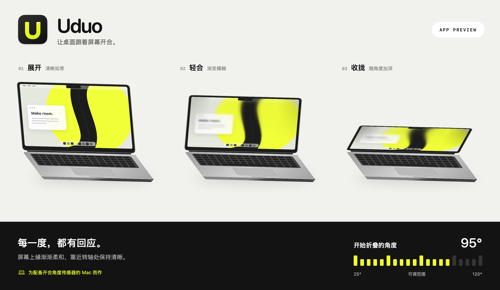

# Uduo

**让桌面跟着屏幕一起开合。**

合上时，桌面折叠、渐渐模糊；抬起时，画面随之展开。

[下载 Mac 版](https://github.com/Youdao-vibecoding/Uduo/releases/latest) · [English](README.md) · [从源码构建](BUILD.md)

免费开源 · macOS 14+ · 配备兼容传感器的 Apple silicon MacBook

查看三种开合状态

界面预览。屏幕内容为效果示意，并非桌面录屏。

Uduo 根据 MacBook 的实际屏幕角度，让桌面产生连续的折叠效果。放慢动作，画面也跟着放慢；中途停住，再抬起，桌面会继续展开。

## 调成顺手的样子

- **停住时保持折叠。** 保留当前折叠效果，抬起屏幕再展开；也可以选择停下后恢复清晰。
- **决定从哪里开始折叠。** 点击或拖动 25–120° 标尺，调整立即保存；也可直接设为现在的屏幕角度。
- **不用动电脑，也能看效果。** 点击“播放效果演示”，看一次完整开合，再自动回到实时预览。演示不会改动你的设置。
- **能轻轻拉动的卡片。** 拖动卡片空白处，会有轻微拉伸、倾斜和回弹。按钮、开关与标尺独立操作，开启系统“减少动态效果”后关闭这项动画。
- **入口由你选择。** 可以显示程序坞图标、菜单栏图标，或同时保留。按 **Control + Option + Shift + H** 切换桌面效果。

实际桌面和左侧效果示意都会随折叠逐渐模糊、加深暗角。左侧预览使用绘制的画面，不额外截取桌面，也不代表实际渲染效果的精确测量。

## 安装

1. 从[最新版本](https://github.com/Youdao-vibecoding/Uduo/releases/latest)下载 DMG。
2. 打开后，将 **Uduo** 拖入 **Applications／应用程序**。
3. 打开 Uduo，在系统设置中允许“屏幕录制”；若 macOS 提示重启应用，按提示操作。
4. 开启桌面效果，轻轻合上一点屏幕。

**签名状态：** Uduo 1.0.0 目前采用临时签名，尚未使用 Developer ID 签名，也未经过 Apple 公证。首次打开可能被 macOS 拦截。确认信任下载来源后，可参照 [Apple 的说明](https://support.apple.com/en-nz/guide/mac-help/mh40616/mac)，在“系统设置 → 隐私与安全性”中允许打开。

屏幕录制权限用于读取桌面并绘制折叠效果。画面仅保存在本机内存中，不保存为文件，也不上传。更新临时签名版本后，系统可能要求重新授予这项权限。

## 下载前确认

需要 **macOS 14 或更新版本**、**Apple silicon MacBook**，以及**兼容的屏幕开合角度传感器**。并非每一款 Apple silicon MacBook 都能使用；桌面效果作用于内置屏幕，外接显示器无法替代所需传感器。

若应用一直提示等待传感器，机型可能无法提供 Uduo 所需的读数。效果演示仍可使用。欢迎在 [Issue](https://github.com/Youdao-vibecoding/Uduo/issues/new) 中反馈兼容情况，并附上 Mac 型号与 macOS 版本。

## 常用操作

| 操作 | 方式 |
| --- | --- |
| 开关桌面效果 | Control + Option + Shift + H |
| 调整开始折叠的角度 | 点击或拖动 25–120° 标尺 |
| 精细调整已选中的标尺 | 方向键每次 1°；Shift + 方向键每次 5° |
| 跳到范围两端 | Home：25°；End：120° |
| 完全退出 | “退出应用”或 Command + Q |

关闭窗口后，效果可以继续运行；再次打开 Uduo，即可找回控制界面。如果已在使用 Softfold 或其他桌面折叠软件，请先退出，再启用 Uduo。

## 隐私与更新

不收集遥测，不自动更新，也不会自动注册开机启动。新版本从本仓库的 Releases 手动下载。卡片拖拽动画不需要申请“辅助功能”权限。

应用使用 SwiftUI、AppKit、ScreenCaptureKit 与 Metal。弹簧交互使用 macOS 14.2 SDK 中可用的接口，未采用新版 Liquid Glass 专用 API。本版没有新增高帧率渲染模式。

## 一起改进

源码构建见 [BUILD.md](BUILD.md)，检查方法见 [CHECKS.md](CHECKS.md)，运动与渲染原理见 [MOTION.md](MOTION.md)。

反馈问题时，请说明屏幕如何移动、出现了什么现象，以及 Mac 型号。可以附上不含隐私内容的短录屏。兼容性、无障碍与翻译改进都欢迎参与。

如果这个小效果让你更喜欢打开电脑，欢迎点一颗 Star。

## 鸣谢与许可

Uduo 是基于 **Reff Wu** 的 [Softfold](https://github.com/ReffWu/softfold) v1.16 开发的独立衍生版本。Softfold 源自 **Noveum.ai** 的 [Hinge](https://github.com/Noveum/hinge)；传感器的 HID 标识与报告结构参考了 [LidAngleSensor](https://github.com/samhenrigold/LidAngleSensor)。

项目采用 [MIT 许可](LICENSE)，保留上游版权声明。Uduo 并非 Softfold 官方发行版。
